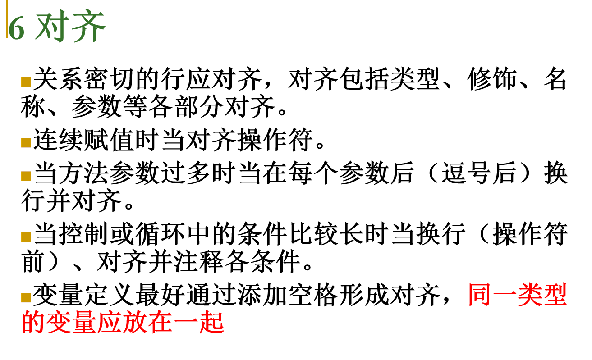
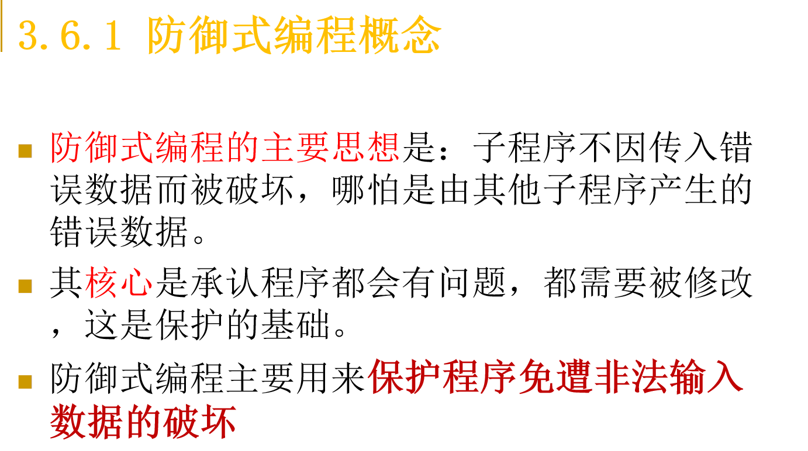
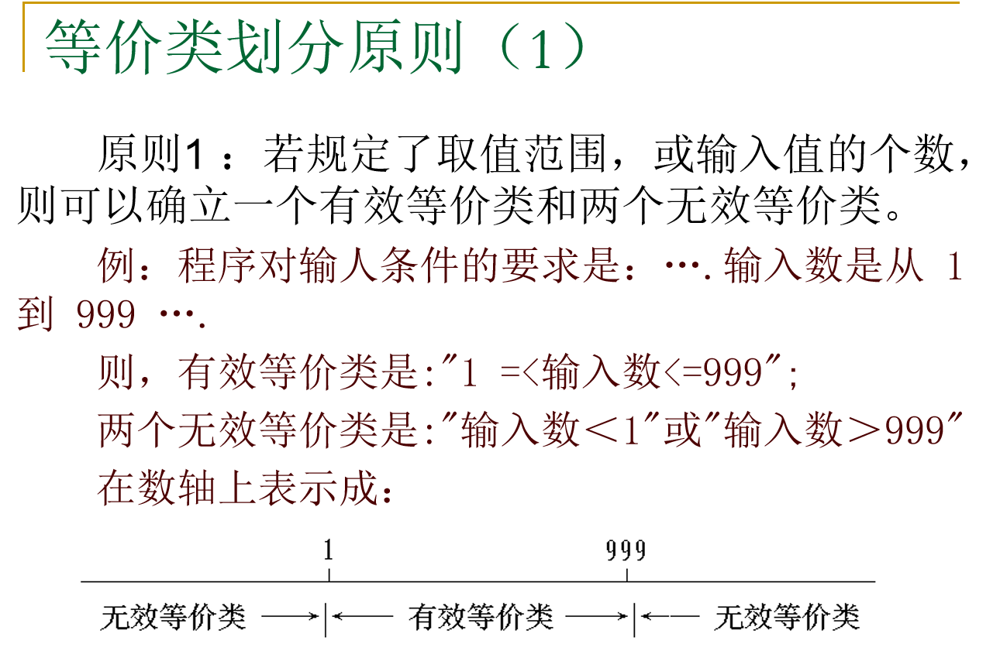

# 软件制造工程复习

## 第一章

选择填空，30张ppt自己看吧

## 第二章——详细设计工具

### 程序流程图

### 伪代码

### 判定表

### 判定树

### 界面设计（判断填空）

### 计算环形复杂度（三种公式）

流程图转流图

## 第三章——软件构件

### 编码规范（判断选择填空）

ppt内标红的内容

### 可以工作的类

### 创建类的原因

### 创建子程序的理由

### 高质量子程序

### 防御式编程

## 第四章——白盒测试 黑盒测试

### 白盒测试（逻辑覆盖）

### 黑盒测试（等价类划分）

